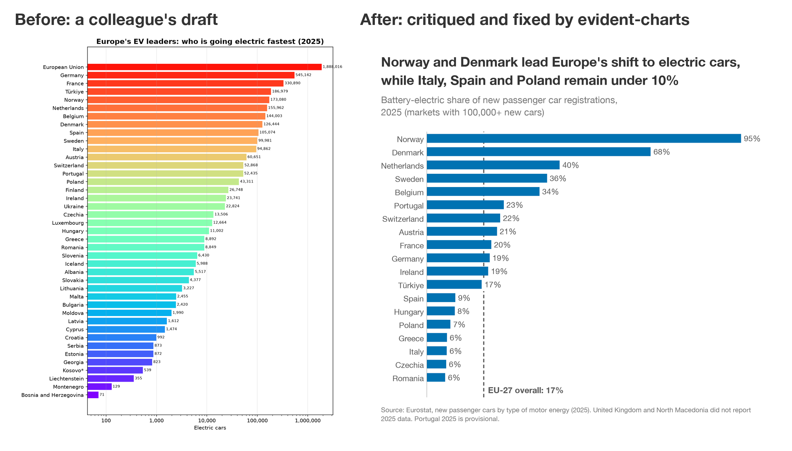

# evident-charts

Teaches AI coding agents to make clear, honest charts, and checks each one before you see it. Works in Claude Code, Codex, Cursor, and more.



<sub>Left: a typical draft, with raw counts on a log scale, the EU total ranked among its own members, and rainbow colors that mean nothing. Right: the same data after evident-charts critiqued and rebuilt it.</sub>

## Use

Ask for a chart the way you already do. The skill loads on its own whenever your agent makes or reviews a chart.

```text
Chart sales.csv for a LinkedIn post on which regions grew fastest.
Make one slide showing where our budget went last year.
Critique this chart and fix it.        (attach the PNG, the script, or both)
```

## What it does

- **Checks the data first:** totals mixed in with their parts, duplicate rows, placeholder codes, preliminary months.
- **Picks the form from the point:** a bar, a line, a table, or one big number.
- **Writes the takeaway as the title** and cites the real publisher, not the file name.
- **Lints the chart in code** (matplotlib): overlapping or clipped text, labels on data, bars that skip zero, dual axes, color-blind confusable colors, low contrast.
- **Reviews the rendered image** with a fresh reviewer that sees only the PNG, and fixes what it finds, up to three rounds.
- **Critiques any chart** you hand it, with ranked fixes that cite a rule.

## Why

Charts from coding agents tend to share the same tells:

- A title that names the topic ("Revenue by region") instead of saying what the data shows
- A legend where labels on the data would fit, and rainbow colors that mean nothing
- Bars that start above zero, or two y-axes on one chart
- Numbers in annotations that were never checked against the data
- A guessed source line, or the file name standing in for one
- Leftover notes like "TODO" or "confirm" on the image

evident-charts checks for each of these before the chart reaches you: with scripts where a rule can be checked in code, and with a review of the rendered image where it can't.

## Install

### Claude Code

```text
/plugin marketplace add rhiever/evident-charts
/plugin install evident-charts@evident-charts
```

### Cursor and other [Agent Skills](https://agentskills.io) agents

```text
npx skills add rhiever/evident-charts
```

### GitHub CLI

Works for Copilot, Claude Code, Cursor, Codex, and Gemini CLI; set `--agent` to yours.

```text
gh skill install rhiever/evident-charts evident-charts --agent claude-code --scope user
```

### Codex

```text
codex plugin marketplace add rhiever/evident-charts
codex plugin add evident-charts@evident-charts
```

### Gemini CLI

The `--auto-update` flag keeps it current.

```text
gemini extensions install https://github.com/rhiever/evident-charts --auto-update
```

## Requirements

Your agent runs the skill's check scripts on your machine. For matplotlib charts they use your project's Python and matplotlib, which you already have. For other libraries (Plotly, ggplot2, D3, and so on), the palette check needs only Python 3, and the image review needs nothing extra.

## Update

| Installed with | Update command |
|---|---|
| Claude Code | `claude plugin marketplace update evident-charts && claude plugin update evident-charts@evident-charts` |
| npx skills | `npx skills update evident-charts` |
| GitHub CLI | `gh skill update evident-charts` |
| Codex | `codex plugin marketplace upgrade evident-charts && codex plugin add evident-charts@evident-charts` |
| Gemini CLI | `gemini extensions update evident-charts` (automatic with `--auto-update`) |

## How the rules work

Each rule carries a tag for how well it is supported: `[E]` experimental evidence, `[P]` practitioner consensus, `[T]` taste or convention. Your project's style guide overrides the house look and any `[T]` rule, but never an `[E]` integrity rule such as bars starting at zero. Every rule is cited in [`references/sources.md`](skills/evident-charts/references/sources.md).

## Works with

- **Libraries:** matplotlib (the default, with a helper and the lint script), seaborn, pandas `.plot`, ggplot2, Plotly, Vega-Lite and Altair, and D3. House themes for the last four are in [`assets/themes/`](skills/evident-charts/assets/themes/).
- **Sizes:** presets for blogs, X, LinkedIn and Instagram, slides, reports, and phones.

## Contributing

Issues and pull requests are welcome. [AGENTS.md](AGENTS.md) covers the tests and the rule format; changes are listed in the [changelog](CHANGELOG.md).

## License

[MIT](LICENSE). Built by [Randy Olson](https://randalolson.com).
